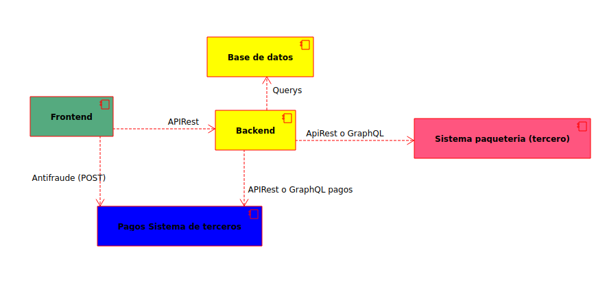

## Requerimientos modelado de una tienda en linea.

       

# Diagrama de componentes
Los componentes para que se pueda hacer la tienda linea son los siguientes:

       

Diagrama de sequencia para realizar un pedido

       

Diagrama de sequencia para realizar el historial de un pedido y el perfil de un cliente

       

