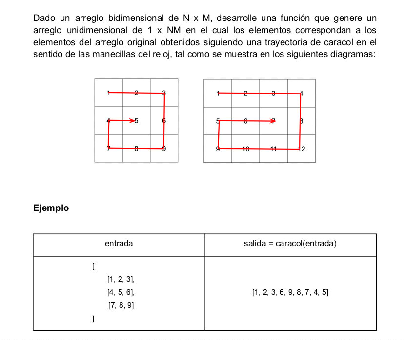

## Requerimientos (Caracol)

<div align="center">
    <a href="#">
       
    </a>
</div>

# Pasos para probar la función

1.- Después de clonar o descargar el proyecto, desde la terminal posicionarse en esta ruta y ejecutar el siguiente comando 
```
./snail.js
```
los resultados se veran reflejados en la terminal.